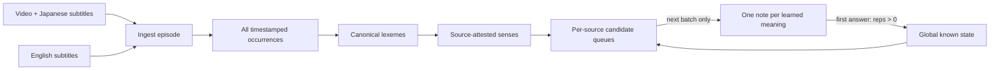

# Multi-source Japanese vocabulary for Anki

This project is a local-first pipeline for building Core 2k/6k-style recognition cards from Japanese video and subtitle sources without teaching the same meaning twice.

The current milestone can ingest external Japanese/English SRT files, align translations using timestamp coverage and textual continuation groups, tokenize Japanese into dictionary-form lexemes, keep episode metadata in SQLite, preview a difficulty queue, extract a sentence-audio clip and still image from the video, and lazily add cards through AnkiConnect.

## The central rule

There are three different states, and they must not be conflated:

1. **Observed**: a word occurred in one or more sources.
2. **Queued**: a source-attested meaning is eligible to become a new card.
3. **Known**: that meaning's Anki card has been answered at least once (`reps > 0`).

Cards are materialized lazily. If the same meaning of `F` occurs in both Hunter x Hunter and Naruto, there is still only one Anki note. If that card was prefetched for HxH but has not been answered, switching to Naruto moves it to the Naruto deck and replaces its primary example with the Naruto context. Once answered, that meaning is globally known and its card stays where it was learned; every other queue skips it. A genuinely different, contextually validated meaning may be taught later while both cards still point to one canonical lexeme. Occurrences from every show remain in the database.



Canonical identity currently uses `(dictionary form, reading)`. This deduplicates
conjugations and merges the same learner-facing item when UniDic assigns different
grammatical roles in different contexts, while keeping homographs with different
readings separate. Treating spelling alone as identity would incorrectly merge
those reading distinctions.

Learning identity uses the canonical lexeme plus a stable JMdict entry/sense
key. Thus `そう？` (reaction: “really?; is that so?”) and `そうする` (manner:
“in that way; do so”) share one lexeme record but remain two learning units.
Reviewing either unit does not mark the other as learned, while the same unit in
another show is skipped globally. Candidate generation, dependency scheduling,
review fingerprints, Anki metadata, and Anki progress all carry this identity.

Content vocabulary includes nouns, pronouns, verbs, adjectives, adverbs,
prenominals, and interjections. Grammatical particles and auxiliary tokens are used
to preserve inflected target spans but are not scheduled as standalone vocabulary.

Before recording those tokens, the tokenizer generates longest-match hypotheses
for exact JMdict entries tagged as expressions or interjections. A pinned local
`multilingual-e5-small` model compares the aligned English subtitle with both the
phrase senses and the component glosses. A phrase replaces its components only
when it clears minimum similarity, winning-margin, and semantic-opacity gates;
ambiguous cases remain safely split. A smaller margin is allowed only for an
opaque multi-component expression that covers the whole utterance.

For example, `どうも。` / "Thank you" is stored as the expression `どうも`, while
`いい顔だぁ！` / "I really do love that look" remains `いい` + `顔`, and the
transparent `どうするか` remains component vocabulary. Contextual homographs are
also rejected when the same surface is a single tokenizer word in isolation.
Every hypothesis and decision is retained in `expression_analyses` with its scores,
margin, opacity, model revision, and winning sense. Embeddings are cached in the
ignored `.vocabdeck/semantic-embeddings.sqlite3` file. The model is downloaded on
first use; subsequent analysis is local, deterministic, and does not require an
LLM or hosted inference service.

## Install

Requirements: Python 3.9+, `ffmpeg`/`ffprobe`, desktop Anki, and the AnkiConnect add-on for direct synchronization.

```bash
uv sync --extra dev
uv run vocabdeck init
```

Audits use UniDic, Sudachi, and OpenJTalk locally for contextual reading
consensus. OpenJTalk downloads its pronunciation dictionary on first use. The
default Sudachi core dictionary is sufficient for consensus; install the much
larger full dictionary with `uv sync --extra reading-full` when broader proper
name and rare-word coverage is worth the disk cost.

## Ingest an episode

List embedded subtitle streams:

```bash
uv run vocabdeck probe "/media/HxH/S01E01.mkv"
```

The ingestion command accepts external SRT files:

```bash
uv run vocabdeck ingest \
  --series "Hunter x Hunter" --season 1 --episode 1 \
  --video "/media/HxH/S01E01.mkv" \
  --ja-srt "/media/HxH/S01E01.ja.srt" \
  --en-srt "/media/HxH/S01E01.en.srt"
```

Or select embedded tracks using the absolute stream indexes printed by `probe`:

```bash
uv run vocabdeck ingest \
  --series "Hunter x Hunter" --season 1 --episode 1 \
  --video "/media/HxH/S01E01.mkv" --ja-track 2 --en-track 3
```

For a batch, create a JSON manifest like [examples/source-manifest.json](examples/source-manifest.json), then choose an episode range:

```bash
uv run vocabdeck ingest-manifest examples/source-manifest.json --episodes 1-10
```

Manifest paths may be absolute or relative to the manifest. Each language can independently use an external `srt` path or embedded `track` index.

Embedded extraction currently supports text subtitle codecs such as SRT/ASS. Image-based PGS/VobSub tracks need an OCR stage and are not treated as Japanese text.

`(series, season, episode)` is unique, so rerunning the command updates that episode rather than silently importing it twice.

Preview the next words:

```bash
uv run vocabdeck queue --series "Hunter x Hunter" --season 1 --episodes 1-10 --limit 20
```

Render the same ordered batch as standalone, revealable cards with source frames and
sentence audio:

```bash
uv run vocabdeck export-preview \
  --series "Hunter x Hunter" --season 1 --episodes 1-10 --limit 20 \
  --output ".vocabdeck/previews/hxh-episodes-1-10.html"
```

Use `--no-media` for a fast text-only preview. This does not modify Anki. The
preview behaves like a review session: it shows one card at a time, blanks the
target word, and keeps the expression, reading, full sentence, image, and audio
hidden until **Show answer** is pressed. Space reveals the answer; the arrow keys
move between cards.

Audit the exact batch before sending it to Anki:

```bash
uv run vocabdeck audit \
  --series "Hunter x Hunter" --season 1 --episodes 1-10 --limit 100 \
  --output ".vocabdeck/audits/hxh-episodes-1-10.html"
```

The standalone report shows every quality criterion beneath each card as
**PASS**, **FLAG**, or **N/A**. These cover subtitle availability and alignment,
definition availability and contextual support, harder unknown context words,
contextual reading consensus, multiword-expression interpretation, and unique
example assignment. It audits the same progressively planned queue used by
`sync-anki`; it never changes learning state.
The report also lists structurally excluded candidates separately. Words without
a reliable definition and one-kana reaction fragments never enter the eligible
queue. Dictionary matches are versioned so older databases automatically recheck
entries when stricter resolver rules are introduced.
Reading warnings are evidence-based: the target's exact lexical span is checked
with Sudachi and OpenJTalk, and a warning is emitted only when both independent
analyzers agree on a reading different from UniDic. Merely having another valid
reading elsewhere in the global dictionary is not a warning.

### Large calibration batches

For a large corpus, first generate a manifest from consistently named video/SRT
pairs and ingest it into a separate database:

```bash
uv run vocabdeck build-manifest "/path/to/episode-directory" \
  --series "Hunter x Hunter" --season 1 --episodes 1-148 \
  --english-track 2 --output ".vocabdeck/hxh-episodes-1-148.json"
uv run vocabdeck --db ".vocabdeck/hxh-full.sqlite3" ingest-manifest \
  ".vocabdeck/hxh-episodes-1-148.json" --episodes 1-148 --skip-existing
uv run vocabdeck --db ".vocabdeck/hxh-full.sqlite3" coverage \
  --series "Hunter x Hunter" --season 1 \
  --output ".vocabdeck/audits/hxh-coverage.json"
```

Materialize the planned ordering before reviewing it. A calibration batch is a
stable checkpoint: it does not mark words known and will not change if Anki state
changes later.

```bash
uv run vocabdeck --db ".vocabdeck/hxh-full.sqlite3" plan-calibration \
  --name "hxh-5000-v1" --series "Hunter x Hunter" --season 1 \
  --episodes 1-148 --limit 5000
uv run vocabdeck --db ".vocabdeck/hxh-full.sqlite3" audit-calibration \
  --name "hxh-5000-v1" --output ".vocabdeck/audits/hxh-5000-v1.html" \
  --json-output ".vocabdeck/audits/hxh-5000-v1.json" \
  --csv-output ".vocabdeck/audits/hxh-5000-v1.csv"
```

Reviewer decisions are stored per card and criterion and appear in subsequent
HTML, JSON, and CSV exports:

```bash
uv run vocabdeck --db ".vocabdeck/hxh-full.sqlite3" label-calibration \
  --name "hxh-5000-v1" --position 12 --criterion translation_alignment \
  --verdict pass --note "Idiomatic but correctly aligned"
```

For bulk review, fill the `review_verdict` and `review_note` columns in the
exported CSV, then import every non-empty verdict. The `review_priority` column
puts automatic flags and near-threshold passes ahead of random pass controls:

```bash
uv run vocabdeck --db ".vocabdeck/hxh-full.sqlite3" \
  import-calibration-reviews --name "hxh-5000-v1" \
  --input ".vocabdeck/audits/hxh-5000-v1.csv"
```

Re-exporting the audit reports agreement counts and both important error types
per criterion: automatic passes rejected by the reviewer and automatic flags
accepted by the reviewer.

On an Apple Silicon Mac with Python 3.10+, the same audit JSON can be reviewed
locally with MLX.
The output is append-only JSONL and resumes by card fingerprint, so an
interrupted overnight run does not repeat completed cards. Similarity scores and
automatic findings are deliberately omitted from the model prompt to avoid
anchoring the reviewer to the thresholds being calibrated:

```bash
uv run vocabdeck --db ".vocabdeck/hxh-full.sqlite3" \
  plan-validation-candidates \
  --series "Hunter x Hunter" --season 1 --episodes 1-10 \
  --targets 200 --candidates-per-target 5 \
  --output ".vocabdeck/audits/hxh-curriculum-candidates.json"
uv sync --extra local-review
HF_HOME=".vocabdeck/huggingface" uv run vocabdeck \
  review-calibration-local \
  --input ".vocabdeck/audits/hxh-curriculum-candidates.json" \
  --output ".vocabdeck/audits/hxh-contextual-reviews.jsonl" \
  --review-pass contextual --deterministic-clean-only \
  --max-per-target 2 --batch-size 4
HF_HOME=".vocabdeck/huggingface" uv run vocabdeck \
  review-calibration-local \
  --input ".vocabdeck/audits/hxh-curriculum-candidates.json" \
  --output ".vocabdeck/audits/hxh-recoverability-reviews.jsonl" \
  --review-pass recoverability --deterministic-clean-only \
  --max-per-target 2 --batch-size 4
HF_HOME=".vocabdeck/huggingface" uv run vocabdeck \
  review-calibration-local \
  --input ".vocabdeck/audits/hxh-curriculum-candidates.json" \
  --output ".vocabdeck/audits/hxh-contextual-gloss-reviews.jsonl" \
  --review-pass contextual_gloss --deterministic-clean-only \
  --max-per-target 2 --batch-size 4
uv run vocabdeck validate-reviewed-cards \
  --input ".vocabdeck/audits/hxh-curriculum-candidates.json" \
  --contextual-reviews ".vocabdeck/audits/hxh-contextual-reviews.jsonl" \
  --recoverability-reviews ".vocabdeck/audits/hxh-recoverability-reviews.jsonl" \
  --contextual-gloss-reviews ".vocabdeck/audits/hxh-contextual-gloss-reviews.jsonl" \
  --output ".vocabdeck/audits/hxh-validated-cards.json"
uv run vocabdeck select-validated-curriculum \
  --input ".vocabdeck/audits/hxh-curriculum-candidates.json" \
  --validation ".vocabdeck/audits/hxh-validated-cards.json" \
  --limit 20 \
  --output ".vocabdeck/audits/hxh-curriculum-selection.json" \
  --preview ".vocabdeck/previews/hxh-curriculum.html"
```

For efficient iterative review, plan only occurrences that satisfy the current
teaching position's dependency gate. Pass the latest selection and append each
model pass to its resumable review file; after validation and reselection, run
the planner again to pick newly unlocked occurrences or alternates for rejected
ones:

```bash
uv run vocabdeck plan-review-frontier \
  --input ".vocabdeck/audits/hxh-curriculum-candidates.json" \
  --selection ".vocabdeck/audits/hxh-curriculum-selection.json" \
  --contextual-reviews ".vocabdeck/audits/hxh-contextual-reviews.jsonl" \
  --recoverability-reviews ".vocabdeck/audits/hxh-recoverability-reviews.jsonl" \
  --contextual-gloss-reviews ".vocabdeck/audits/hxh-contextual-gloss-reviews.jsonl" \
  --limit 24 --output ".vocabdeck/audits/hxh-review-frontier.json"
```

The eligible target pool and its meaning-level priority are frozen before
occurrence validation. The final teaching order is dynamic: at each step the scheduler
looks within a bounded lexical frontier, chooses a validated sentence that fits
the learner's current known-word state, then treats its target as known for the
next step. This allows a clean prerequisite to move ahead of a lexically earlier
word without letting an unrelated easy or katakana-heavy word reshape the pool.
Candidate order remains a ranking of examples for the same target, not a second
vocabulary ranking.

The validation policy fails closed. The contextual pass checks the occurrence's
word boundary, part of speech, and dictionary sense. A separate, narrowly
prompted recoverability pass checks that the English subtitle actually expresses
the target's contribution instead of merely being a natural translation of the
whole utterance. The contextual-gloss pass independently checks that the
learner-facing definition explains the target's sense in this occurrence. Any
deterministic finding, stale or missing model review, reviewer disagreement, or
uncertainty rejects or abstains on that sample.
Production generation can then try a different occurrence and omit the word if
no occurrence receives unanimous approval.

The production scheduler applies a hard progressive-comprehensibility policy:
teaching positions 1–20 allow no other unknown content words, positions 21–200
allow one, and later positions allow two. Particles, auxiliaries, punctuation,
and recognized grammar tokens are not counted as vocabulary. An allowed unknown
must also be scored near or below the target; an unscored or substantially harder
word fails closed. These boundaries and the lexical-frontier size are configurable
on `select-validated-curriculum`.

For a conservative learning preview, reject every questionable sample and look
for an unused occurrence whose surrounding vocabulary is already known. The word
is postponed only when no clean alternative exists:

```bash
uv run vocabdeck --db ".vocabdeck/hxh-full.sqlite3" export-clean-preview \
  --series "Hunter x Hunter" --season 1 --episodes 1-10 --limit 200 \
  --output ".vocabdeck/previews/hxh-episodes-1-10-clean-200.html" \
  --audit-output ".vocabdeck/audits/hxh-episodes-1-10-clean-200.html" \
  --selection-output ".vocabdeck/audits/hxh-episodes-1-10-clean-200-selection.json"
```

The selection JSON explains every postponed word. A postponed target remains
unknown. The scheduler may teach a validated prerequisite first and reconsider
the blocked target on the next iteration; if no qualifying occurrence becomes
available, the target remains deferred.

Three explainable difficulty metrics are available:

- `source`: repeated words in the selected episodes first; immersive, but show-specific vocabulary can arrive too early.
- `general`: broad Japanese frequency first; closest to a traditional core list, but ignores whether the source offers a teachable example.
- `hybrid` (default): general frequency + repetition in the source + known-word-aware sentence burden + form and sentence-quality penalties.

Compare their actual candidates before choosing:

```bash
uv run vocabdeck compare-difficulty \
  --series "Hunter x Hunter" --season 1 --episodes 1-10 --limit 15
```

Every queued row includes a 0–100 difficulty score and its component breakdown. Lower is easier. Select a non-default metric with `queue --metric source` or `sync-anki --metric general`.

The general prior currently comes from `wordfreq`, which combines multiple kinds of language data. The source component is calculated only from the episodes you selected. This lets the tool distinguish broadly useful Japanese from vocabulary that is merely frequent within one show.

Add offline JMdict English definitions after ingestion:

```bash
uv run vocabdeck enrich-dictionary \
  --series "Hunter x Hunter" --season 1 --episodes 1-10
```

The resolver matches spelling and reading, favors common entries, checks coarse part of speech, and uses English subtitle context conservatively when choosing among senses. The selected JMdict entry, sense index, and confidence are stored in card metadata. Dictionary data is provided by the JMdict/EDICT project under its attribution/share-alike terms.

With Anki open, pull new review state and add the next batch:

```bash
uv run vocabdeck sync-anki --series "Hunter x Hunter" --season 1 --episodes 1-10 --limit 20
```

Run `sync-anki` whenever switching sources and before obtaining a new batch. It first reads every tracked card's review count, updates the global known set, and only then fills the active source. The card front shows the definition, learner-friendly part of speech, a Japanese sentence with the target blanked, and the aligned English subtitle. Revealing the answer shows the expression, reading, completed sentence, authentic sentence audio, frame from the scene, and source metadata. Existing project note types are migrated to the current fields, template, and styling during synchronization.

In Anki's deck options, keep **Insertion order** on **Sequential**, set **New card gather order** to **Ascending position**, and **New card sort order** to **Order gathered**. Those settings preserve the difficulty order produced by this tool; review cards should still follow Anki/FSRS scheduling.

## Ordering model

The default hybrid score combines:

- a broad Japanese frequency prior (so corpus-specific jargon does not appear too early),
- morphology and orthographic complexity,
- frequency across all imported sources,
- sentence difficulty based on the fraction of words already known, length, and grammar,
- penalties for fragments, missing translations, and dialogue fillers.

Word ordering and example selection are planned together at batch time. For each
position, the production planner first enforces the hard unknown-word allowance,
then prefers fewer unknowns, lexical priority, and the best validated occurrence.
Each selected target is treated as provisionally known for subsequent cards.
Exact token spans are retained so an inflected form such as `いた` is blanked in
full at its morphological occurrence rather than matching an unrelated `い`
elsewhere in the sentence.
A future refinement can add JLPT/graded vocabulary levels and explicit grammar
complexity. Changing metrics reranks only unseen cards and does not disturb Anki
review history.

## Important product decisions

- **“Known” means introduced, not mastered.** The first answer is enough to prevent a duplicate new card elsewhere. Anki/FSRS remains responsible for whether the word is actually retained.
- **One note, many occurrences.** A vocabulary card has one primary context, but its database record can point to every show, season, episode, timestamp, and subtitle line where it appeared.
- **One global lexeme, distinct learning units.** Identical spelling and reading remain globally deduplicated. Each occurrence maps to a stable JMdict sense; the same sense is learned once across all shows, while a genuinely different validated sense can receive its own card.
- **One sentence, one teaching card.** Once a sentence is selected for a card, it is reserved. Other words use a different occurrence or wait until another source supplies one.
- **Decks are views, not the source of truth.** SQLite owns global identity and source history; Anki owns review scheduling and logs.
- **Never delete or move reviewed cards during deduplication.** A reviewed card stays in its original deck. An unreviewed prefetched card may move when its source changes; other queues skip the learned meaning.
- **Batch lazily.** Creating thousands of duplicate suspended notes up front makes reconciliation fragile and pollutes the collection.

## Roadmap

1. Add explicit grammar-complexity signals and optional JLPT/graded vocabulary priors.
2. Add furigana formatting and optional isolated-word TTS. Source audio already supplies authentic sentence reading.
3. Add an Anki add-on companion that triggers synchronization after review and offers a source switcher inside Anki. Until then, the CLI is the synchronization boundary.
4. Add conflict recovery for cards manually deleted, moved, or merged inside Anki, plus backups and an audit command.

The longer-term companion-app concept—including separate grammar progress,
tap-to-explain constructions, and accessible sentence color coding—is documented
in [docs/future-app.md](docs/future-app.md).

## Tests

```bash
uv run python -m unittest discover -s tests -v
```

The regression suite includes the exact Hunter x Hunter → Naruto → Hunter x Hunter scenario from the design.
